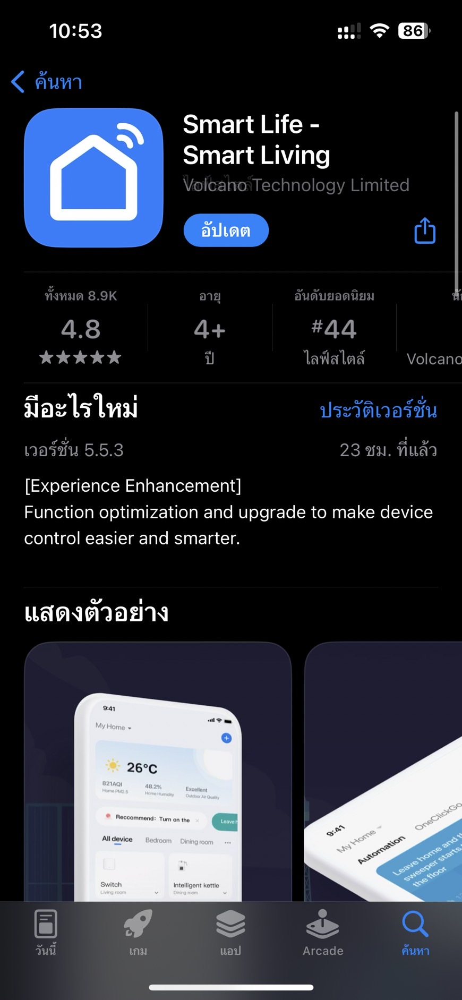
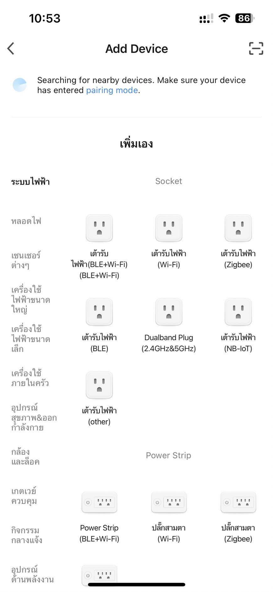
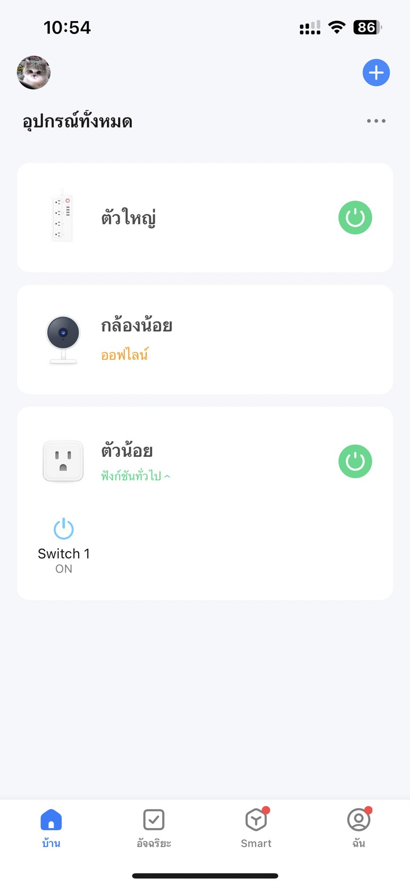

# Start making TinyTuya
## 1.Download the Tuya Smart or Smart Life application.

## 2.Add all available devices into the application


## 3.Open Visual Studio Code and insert this code.

```python
import tinytuya

d = tinytuya.OutletDevice('DEVICE_ID_HERE', 'IP_ADDRESS_HERE', 'LOCAL_KEY_HERE')
d.set_version(3.3)
data = d.status() 
print('Device status: %r' % data)